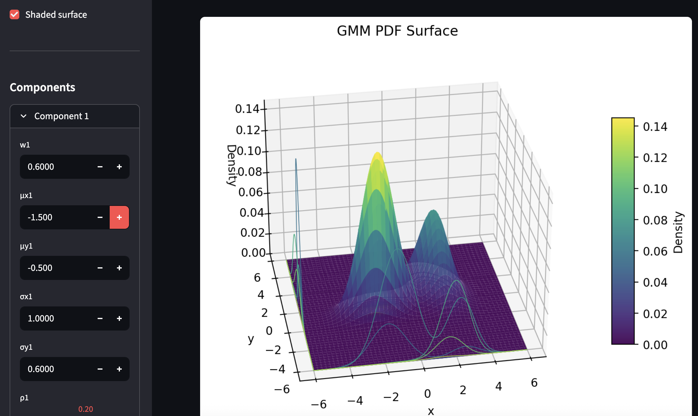

# GMM visualizer
Streamlit and Matplotlib visualizer for the PDF of a 2D GMM. The app lets you configure the parameters of the GMM, and the visualization is updated accordingly, rendered in 3D space.

` uv run streamlit run src/gmm_visualizer/main.py` to run the app

